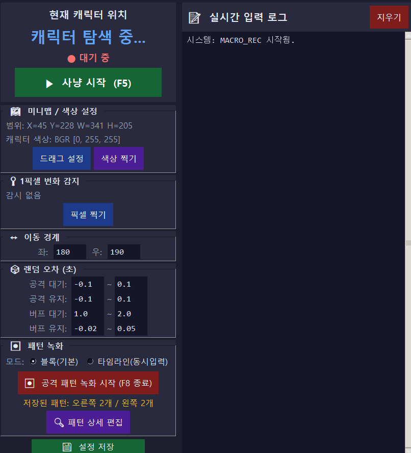
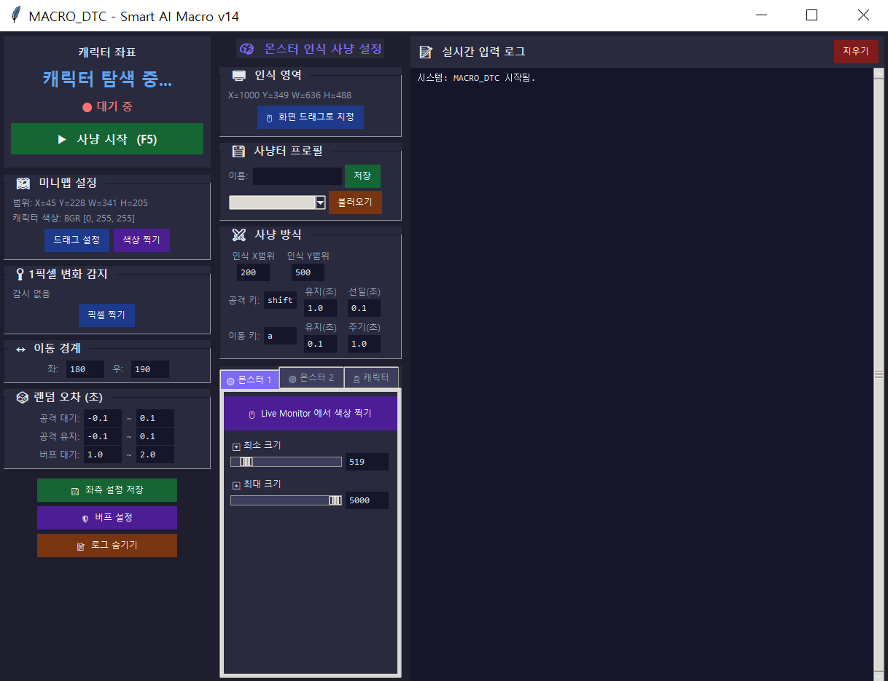

# 🎮 Game Auto-Hunting Macro Suite

이 레포지토리는 사용자의 플레이 패턴을 그대로 녹화하여 재현하는 **패턴 녹화 방식 매크로(MACRO_REC)**와 실시간 OpenCV 컴퓨터 비전 기술을 접목한 **객체 감지 방식 매크로(MACRO_DTC)**, 두 가지 강력한 게임 자동사냥 도구를 제공합니다.

고급 하드웨어 입력 모방, 강력한 안티 디텍션(우회) 랜덤 오차 시스템, 직관적인 UI가 결합되어 최상의 프리미엄 매크로 경험을 선사합니다.

---

## 🏛️ 프로그램 개요 (Architecture Overview)

| 프로그램 | 핵심 메커니즘 | 주요 특징 | 추천 사용 대상 |
| :--- | :--- | :--- | :--- |
| **`MACRO_REC.py`** | **키보드 패턴 녹화 & 좌표 기반 이동** | 정확한 스킬 연계 타이밍 재생, 블록/타임라인 동시입력 녹화 지원, 패턴 디테일 에디터 내장 | 복잡한 버프/스킬 연계가 필요하고 미니맵으로 좌표 감지가 가능한 게임 |
| **`MACRO_DTC.py`** | **OpenCV 실시간 AI 비전 감지** | 화면 객체(몬스터/캐릭터) 실시간 트래킹, Live Monitor 박스 표시, 원클릭 HSV 색상 추출 | 몬스터가 무작위 위치에 젠되고 정밀한 조준이나 추적이 필요한 게임 |

---

## 1️⃣ MACRO_REC.py — 패턴 녹화 방식 매크로

사용자가 직접 입력하는 사냥 키보드 패턴을 밀리초(ms) 단위로 정확히 녹화한 후 재생합니다. 미니맵 색상 분석을 통해 캐릭터의 현재 좌표를 파악하고, 지정된 좌/우 경계(Boundary)에 도달하면 부드럽게 방향을 전환하여 사냥을 이어나갑니다.

### 🖼️ UI 스크린샷 (User Interface)


### ✨ 주요 기능
* **양방향 개별 패턴 녹화**: 오른쪽 이동 시의 사냥 패턴과 왼쪽 이동 시의 사냥 패턴을 각각 독립적으로 녹화하여 게임 지형에 최적화된 동선을 구축합니다.
* **에디터 탑재**: 녹화된 키보드 입력을 실시간 리스트박스 형태로 확인하고 대기 시간(Delay) 및 유지 시간(Duration)을 세밀하게 수정하거나 추가/삭제할 수 있습니다.
* **1픽셀 변화 감지 (Pixel Watcher)**: 화면의 특정 한 점을 모니터링하여 색상이 변할 경우 경고 알림 및 로그를 띄웁니다.
* **랜덤 오차(Jitter) 시스템**: 사람의 무작위 타이밍을 모방하기 위해 모든 스킬과 버프의 지연시간 및 유지 시간에 미세한 랜덤 오차 범위를 직접 지정할 수 있습니다.

---

## 2️⃣ MACRO_DTC.py — 객체 감지 방식 매크로

실시간으로 게임 화면을 모니터링하며 OpenCV 기반 HSV(Hue, Saturation, Value) 가상 트래커로 아군 캐릭터와 적(몬스터)을 인식합니다. 감지된 몬스터 위치를 기반으로 캐릭터가 최적의 반경 내로 접근하고 스킬을 시전합니다.

### 🖼️ UI 스크린샷 (User Interface)


### ✨ 주요 기능
* **Live Monitor 트래킹**: 실시간 캡처 화면 위에 캐릭터와 몬스터들의 물리적 위치를 직관적인 박스 가이드라인으로 출력합니다.
* **간편한 마우스 원클릭 색상 추출**: Live Monitor 화면에서 캐릭터나 몬스터의 픽셀을 클릭하는 것만으로 최적의 HSV 컬러 값을 자동으로 저장 및 갱신합니다.
* **스마트 타겟 분석**: 캐릭터를 중심으로 설정한 수평/수직 인식 반경(`Smart Radius`) 내에 몬스터가 존재할 때만 스킬과 공격을 실행하며, 멀리 있을 때는 부드럽게 이동기를 시전해 접근합니다.
* **멀티 프로필 관리**: 몬스터의 종류, 사냥터, 스킬 배치 등에 따라 여러 설정 세트를 편리하게 저장 및 로드할 수 있습니다.

---

## ⚡ 공통 안티 디텍션 및 안전 장치 (Security & Safety)
* **Pydirectinput 하드웨어 신호 모방**: 일반 가상 키 입력이 아닌, OS 드라이버 레벨에 근접한 DirectInput 방식으로 작동하여 대부분의 PC 게임 환경에서 완벽하게 작동합니다.
* **물리적 Failsafe 기본 탑재**: 프로그램 실행 도중 급박한 상황이 발생했을 때, 마우스를 화면의 가장자리 모서리로 빠르게 가져가면 즉각 매크로가 강제 중단(Failsafe)되어 계정을 안전하게 보호합니다.
* **인터럽트 슬립 (Interruptible Sleep)**: 긴 시간 대기하는 스레드 동작 중에도 F5 정지 키를 누르거나 프로그램이 중단되면 지연 시간 도중에 즉각 반응하여 모든 키 누름을 해제(Release)합니다.

---

## ⚙️ 시작하기 (Quick Start)

### 1. 요구 사항 및 종속성 라이브러리 설치
본 프로그램들은 Python 3.8 이상 환경에서 최적으로 작동합니다. 실행 전 필요한 라이브러리를 터미널에 설치해 주세요.

```bash
pip install opencv-python numpy keyboard pydirectinput mss
```

### 2. 실행 방법
각각 독립적인 UI로 실행할 수 있습니다. 원하는 매크로 스크립트를 터미널이나 CMD에서 구동하십시오.

* **패턴 녹화형 매크로 실행:**
  ```bash
  python MACRO_REC.py
  ```

* **비전 감지형 매크로 실행:**
  ```bash
  python MACRO_DTC.py
  ```

---

## 🕹️ 사용 시나리오 예시

1. **지형이 복잡하고 정해진 빌드(사냥 동선)가 중요한 던전**
   * **`MACRO_REC.py`**를 실행하여 안전한 빌드로 몬스터를 스위핑하는 키보드 패턴을 녹화한 뒤 구동하십시오.
2. **넓은 평지 맵에서 무작위로 리젠되는 몬스터를 사냥해야 할 때**
   * **`MACRO_DTC.py`**를 실행하고 몬스터와 캐릭터의 색상을 클릭하여 지정한 뒤, AI 비전 트래커 사냥을 작동시키십시오.

---

## ⚖️ 면책 조항 (Disclaimer)
* 본 매크로 도구는 교육 및 개인 학습, 입력 자동화 실험 목적으로 개발되었습니다.
* 타사의 온라인 게임 서비스 약관에 위배되는 부정 사용으로 인해 발생하는 계정 제재, 불이익 등에 대한 모든 책임은 사용자 본인에게 있습니다.
